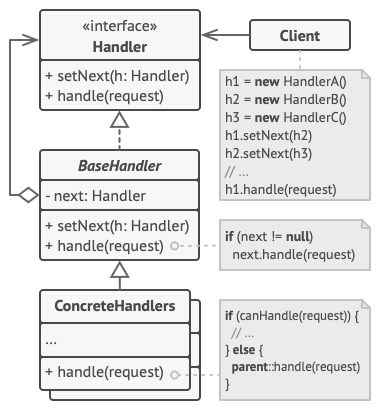

# Chain of Responsibility Pattern

Chain of Responsibility is a behavioral design pattern that lets you pass requests along a chain of handlers. Upon receiving a request, each handler decides either to process the request or to pass it to the next handler in the chain.

## Intent:
The primary intent of the Chain of Responsibility Pattern is to allow an object to pass the request along a chain of potential handlers until an object handles it or the end of the chain is reached.

## Components:
Handler: This is the interface (or abstract class) that defines a method for handling the requests. It might also (optionally) implement the successor link, which points to the next handler in the chain.

ConcreteHandler: Individual classes that implement the Handler interface. Each handler decides either to process the request or to pass it to the next handler in the chain.

Client: The sender of the request, which is passed along the chain.

## How it Works:
The client sends a request to the chain. The request is passed along the chain of potential handlers until it's either handled or reaches the end of the chain.

Each handler in the chain decides whether it can handle the request or if it should be passed further along the chain.

## Advantages:
Decoupling: Decouples sender and receiver objects, promoting loose coupling.

Flexibility: Allows dynamic addition or removal of responsibilities by changing members within the chain.

Clarity: Simplifies your code since objects can pass requests without knowing the structure of the chain.

## Disadvantages:
Performance Concerns: Every request goes through potentially lengthy chains which can affect performance.

Debugging: It might be challenging to observe and debug the behavior of a request throughout the chain.

Guarantee: There's no guarantee that the request will be handled as it might fall off the end of the chain.

## Use cases
1. **Event Propagation**:
GUIs often implement event-handling systems where events can be handled at multiple levels. For instance, a button might have a click handler, but if it doesn't, the event could be passed up to the containing panel or window to handle.

2. **Middleware in Web Frameworks**:
Web frameworks like Express.js use middleware to process requests and responses. Each middleware function can either end the request/response cycle or pass control to the next middleware function.

3. **Input Validation**:
For complex input validation, you can set up a chain where each link is responsible for validating a particular aspect of the input. If one link fails, the chain can be broken, and the input can be rejected.

4. **Logging Frameworks**:
Logging different levels (Info, Debug, Error, etc.) can be handled by different handlers. The logging request is passed along the chain until it finds the appropriate handler that logs messages of that severity.

5. **Filtering**:
Implementing a series of filters that process data. Each filter in the chain modifies or analyzes the data before passing it to the next.

6. **Command Processing**:
In command-line tools or interpreters, different handlers can be set up to process different commands. The input command is passed through each handler until one recognizes and processes it.

7. **Authorization and Authentication**:
In software systems, especially web-based ones, you might have multiple levels of authentication and authorization checks. Requests can pass through a chain where each handler checks a particular aspect of user credentials or permissions.

8. **Payment Processing**:
When there are multiple payment gateways or methods available, a chain of handlers can be used to attempt processing the payment through different gateways, one after the other, until successful.

9. **Adaptive Handling**:
In scenarios where there are fallback strategies (e.g., trying to fetch data first from a cache, then a primary database, then a backup), the Chain of Responsibility can model these fallback mechanisms.

10. **Dynamic Handling**:
When the set of handlers needs to be determined at runtime based on external factors, the Chain of Responsibility provides a flexible way to create and modify the chain.

##
The Chain of Responsibility pattern is especially useful when an application requires multiple objects to handle different types of requests or when there's a need for a dynamic change in the handling configuration. It's essential to ensure that the chain's design and handling mechanisms are well thought out to avoid unnecessary complications.
